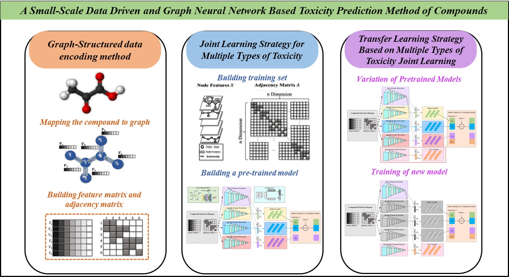

**Publication Notice**  
This work has been published in the journal:  *Computational Biology and Chemistry*.  
Paper link: [https://doi.org/10.1016/j.compbiolchem.2025.108393](https://doi.org/10.1016/j.compbiolchem.2025.108393)  
For more details, please refer to the published article.

## Graphica Abstract

# JLGCN-MTT Experiment Workflow README

This README provides an overview of the experiment workflow, including the data preprocessing and the generation of the required dataset for running the Graph Convolutional Network (GCN).

## 1. Data Preprocessing

The data preprocessing is handled through two Python scripts: **data/replace.py** and **data/graph_adj.py**. These scripts will help you generate the necessary files required for GCN.

### Step 1: Running `replace.py`
The **replace.py** script is responsible for preprocessing the raw data and preparing it for graph construction. This script performs operations such as cleaning and formatting the data as needed.

### Step 2: Running `graph_adj.py`
Once the raw data has been processed, the **graph_adj.py** script generates three critical files for the GCN:

- **Node Features File** (`node_features.txt`): This file contains the features of the nodes in the graph.
- **Adjacency Matrix File** (`adjacency_matrix.txt`): This file defines the connections or relationships between nodes, representing the graph structure.
- **Node Index File** (`node_indices.txt`): This file contains the indices of the nodes, which are used to identify each node in the graph.

### Step 3: Label File
In addition to the above three files, a **label file** (`labels.txt`) is required. This file contains the labels for each node in the graph. The label file can be directly obtained from the dataset you are working with.

Once the **node features**, **adjacency matrix**, **node indices**, and **labels** files are generated, they constitute the dataset for the GCN model.

## 2. Conclusion

With the above steps, the preprocessing for your GCN dataset is complete. The generated files are now ready to be used for training and testing the Graph Convolutional Network.
